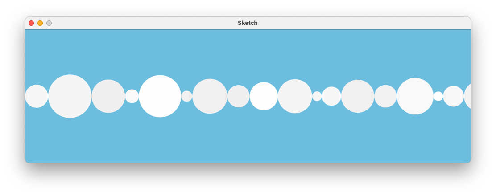

# Processing Methods Example
This is an example Processing sketch that demonstrates the use of methods to draw multiple bubbles across the canvas: 

Each bubble has a randomly generated diameter and light colour. The bubbles are drawn in a horizontal line until the width of the canvas is filled.

The random generation makes this a procedurally generated sketch, meaning it will look different each time it is run.

### Design Choices
Here are a few notes on how the code is structured:
- Method decomposition was used to separate the bubble drawing logic into its own method (`drawBubble`). This improves code readability and reusability.
- The `drawBubble` method returns the diameter of the bubble it draws. This allows the main loop to correctly space the bubbles without overlap.
- Random values are used for both the diameter and colour of the bubbles to create visual variety.
- The sketch uses a `while` loop to continue drawing bubbles until the entire width of the canvas is filled.
- A counter variable (`currentX`) is used to track the horizontal position for drawing the next bubble.
